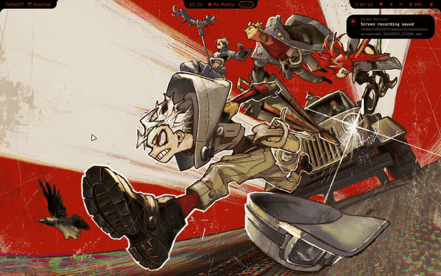
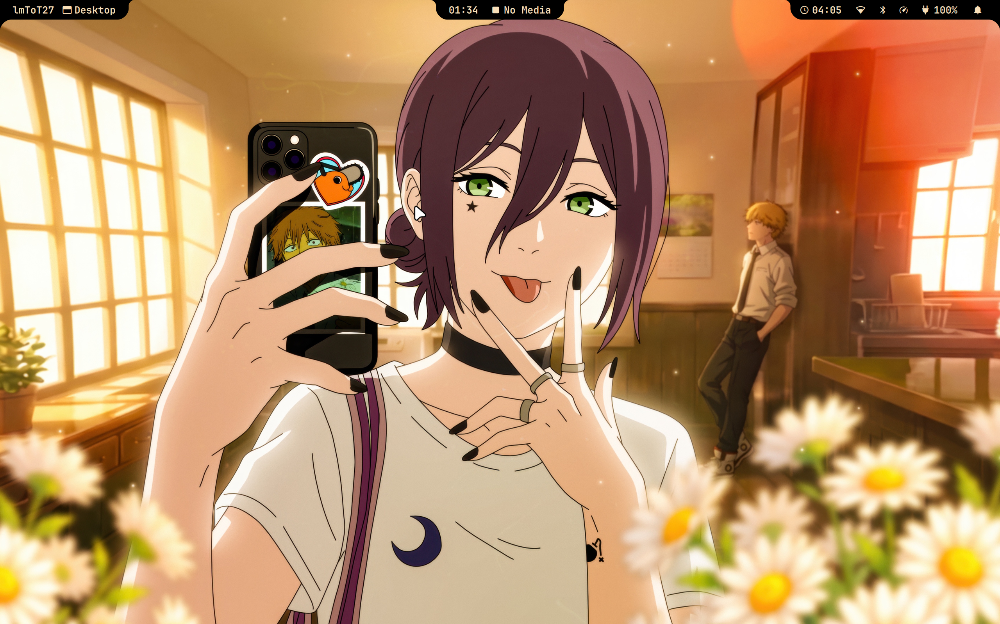
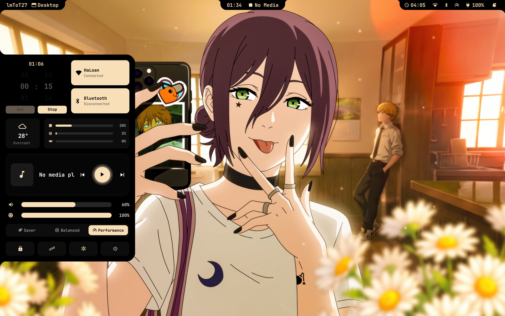
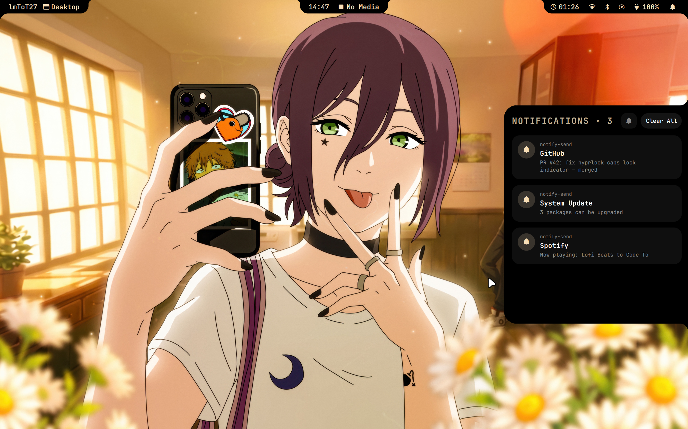
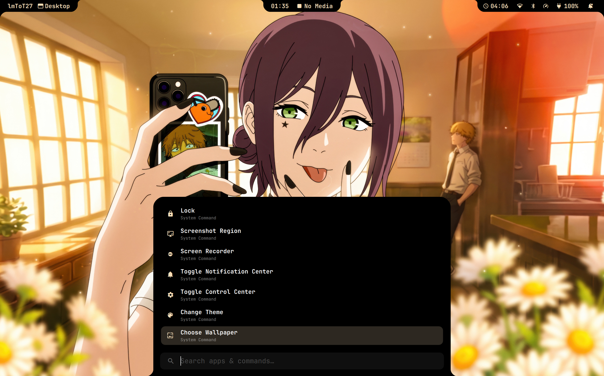

# dot27

A NixOS + [niri](https://github.com/YaLTeR/niri) + [Quickshell](https://quickshell.outfoxxed.me/)
desktop shell — replaces rofi/waybar/swaync-style ad-hoc scripts with a set of
panels/pills sharing one "Fluid" design language. See `CLAUDE.md` for the
design conventions if you're editing `dotfiles/quickshell`.

## Preview



## Screenshots



| Control Center | Notification Center | App Launcher |
|---|---|---|
|  |  |  |

## Keybindings

**Apps**

| Key | Action |
|---|---|
| `Mod+T` | Terminal (kitty) |
| `Mod+W` | Browser (Brave) |
| `Mod+E` | File manager (Thunar) |
| `Mod+S` | Spotify |
| `Mod+Return` | App Launcher — search apps + system commands |

**Panels**

| Key | Action |
|---|---|
| `Mod+M` | Control Center |
| `Mod+N` | Notification Center |
| `Mod+J` | Hide/show the topbar |
| `Mod+Tab` | Niri overview |
| `Mod+V` | Clipboard history |
| `Mod+Shift+V` | Wipe clipboard history |
| `Mod+Period` | Emoji picker |

**Screenshot / recording / lock**

| Key | Action |
|---|---|
| `Mod+Shift+S` | Screenshot region |
| `Mod+Shift+R` | Toggle screen recorder |
| `Mod+L` | Lock screen |

**Windows**

| Key | Action |
|---|---|
| `Mod+Q` | Close window |
| `Mod+F` | Toggle floating |
| `Mod+Shift+F` | Fullscreen |
| `Mod+Left` / `Mod+Right` | Focus column left/right |
| `Mod+Shift+Left` / `Mod+Shift+Right` | Move column left/right |
| `Mod+Up` / `Mod+Down` | Focus workspace up/down |
| `Mod+Shift+Up` / `Mod+Shift+Down` | Move column to workspace up/down |
| `Mod+Minus` / `Mod+Equal` | Shrink/grow column width |

**Media, volume, brightness** (work even while the screen is locked)

| Key | Action |
|---|---|
| Volume Up / Down / Mute | Adjust volume, flashes the OSD |
| Mic Mute | Toggle microphone mute |
| Brightness Up / Down | Adjust brightness, flashes the OSD |
| Play/Pause, Stop, Next, Prev | Media player control |

**Session**

| Key | Action |
|---|---|
| `Mod+Shift+E` | Quit niri (ends the session) |

## Usage

- **App Launcher** (`Mod+Return`) searches installed apps and a set of system
  commands in one list: wallpaper/theme pickers, panel toggles, screenshot,
  noise suppression, and power actions (Lock, Sleep, Hibernate, Log Out,
  Reboot, Power Off).
- **Changing wallpaper** (App Launcher → "Choose Wallpaper", or
  `~/.local/bin/changewallpaper.sh <path>`) re-derives an accent color from
  the image and applies it live across the topbar, rofi, the zsh prompt, and
  the hyprlock screen — no restart needed.
- **Control Center** (`Mod+M`) has WiFi/Bluetooth toggles, a focus timer,
  weather/system stats, media controls, volume/brightness sliders, power
  profile switching, and Lock/Log Out/Reboot/Power Off.
- **Notification Center** (`Mod+N`) keeps notification history; "Clear All"
  dismisses everything at once.
- **Lock screen**: typing with Caps Lock on shows an accent-colored border
  around the password field instead of the usual dim outline.

## Layout

This repo only holds the **shared, machine-agnostic** half of the setup:

```
flake.nix        # standalone flake, exposes homeManagerModules.default
dot27_home.nix   # home-manager module: packages, program configs, dotfiles symlinks
dotfiles/        # niri, quickshell, nvim, kitty, zsh, scripts, hyprlock, rofi, cava configs
etc-nixos/*.example  # templates for the personal half, see below
```

The **personal, per-machine** half — NixOS user account, hardware config, git
identity, timezone, GPU driver settings, your own extra packages — lives
outside git entirely, at `/etc/nixos/`:

```
/etc/nixos/flake.nix      # the flake actually built; depends on this repo
                           # (path input "dot27") for homeManagerModules.default
/etc/nixos/configuration.nix
/etc/nixos/hardware-configuration.nix
/etc/nixos/home.nix       # your own packages/git identity, imported alongside
                           # this repo's home-manager module
```

A third, lighter-weight spot for per-machine tweaks is `~/override/` — a plain
directory (created by `install.sh`) that sits next to `~/dot27`, outside git,
for small untracked overrides that don't warrant a NixOS module (see
"Overriding niri keybinds/rules" below).

`nixos-rebuild switch` defaults to `/etc/nixos`, so once set up you just run
`sudo nixos-rebuild switch --update-input dot27` from anywhere. The
`--update-input dot27` part matters: `/etc/nixos/flake.lock` pins this repo's
input by content hash the same as any remote flake input, so a plain
`nixos-rebuild switch` silently keeps building whatever `~/dot27` looked like
the last time the lock was written, even after further edits or a `git pull`.

## First-time setup

```
git clone https://github.com/lmToT27/dot27.git ~/dot27
cd ~/dot27
./install.sh
```

`install.sh` asks for your Linux username, full name, and git identity, then
generates `/etc/nixos/{configuration,home,flake}.nix` from the `etc-nixos/*.example`
templates with those values filled in. It's safe to re-run: files it already
generated (marked with a `# Generated by dot27 install.sh` comment) are left
alone; anything else already at those paths (e.g. the stock NixOS-installer
default) gets backed up to `<file>.orig-<timestamp>` before being replaced.
It also regenerates `hardware-configuration.nix` for the current machine every
run, and clones the SDDM theme into `./sddm` (gitignored).

It does **not** run `nixos-rebuild` itself — review the printed checklist
(GPU driver section, timezone/locale, `~/.face.icon`) and run it yourself:

```
sudo nixos-rebuild switch --update-input dot27
```

## Updating

Pull the latest shared dotfiles, then rebuild with `--update-input dot27` so
the pinned copy in `/etc/nixos/flake.lock` actually gets refreshed:

```
cd ~/dot27
git pull
sudo nixos-rebuild switch --update-input dot27
```

This applies to any edit under `~/dot27`, not just a `git pull` — the lock
only moves when you explicitly tell it to.

To bump `nixpkgs`/`home-manager`/`spicetify-nix` to their latest upstream
revisions:

```
cd /etc/nixos
sudo nix flake update          # all inputs
sudo nix flake update nixpkgs  # just one
sudo nixos-rebuild switch
```

## Adding your own packages

Edit `/etc/nixos/home.nix` — it's a normal home-manager module, merged
alongside this repo's `dot27_home.nix` (home-manager concatenates `home.packages`
from every imported module automatically):

```nix
home.packages = with pkgs; [
  kaggle
  visidata
  ruff
  discord   # whatever you want
  (python3.withPackages (ps: with ps; [
    debugpy pygobject3 pip requests numpy pandas
    ortools matplotlib seaborn
  ]))
];
```

**One caveat**: only one `python3.withPackages (...)` derivation can exist in
the whole system without a `bin/python3` collision at build time. If you want
more Python libraries, add them *inside* the existing `python3.withPackages`
call in `/etc/nixos/home.nix` — don't declare a second one.

Changes here never touch git — this repo stays identical for every machine
that uses it.

## Overriding niri keybinds/rules

Create `~/override/niri-local.kdl` (see `dotfiles/niri/niri-local.kdl.example`
for the format) — niri includes it automatically if present:

```kdl
binds {
    Mod+T { spawn "alacritty"; }
}

window-rule {
    match app-id=r"^org\.telegram\.desktop$"
    open-on-workspace "chat"
}
```

Binds here override the same key from `dotfiles/niri/binds.kdl`; window rules
are added alongside the existing ones. The file is optional — niri just logs
a warning if it's missing — and niri live-reloads it on save, no rebuild or
`niri msg` needed. It lives in `~/override/`, a sibling directory of `~/dot27`
(created by `install.sh`), not under `~/.config/niri`, since that whole
directory is a symlink into this repo. `~/override/` is the general home for
this kind of untracked, per-machine dotfile override — not just niri's.
